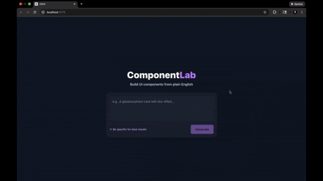

# ComponentLab ⚡

> Transform natural language into production-ready React components in seconds

<p align="center">
  <a href="https://componentlab-ai.vercel.app"></a>
  
  
  
</p>

<p align="center">
  
</p>

<p align="center">
  An AI-powered UI component generator that transforms natural language into production-ready React components with live preview and code editing.
</p>

---

## 🎯 Why ComponentLab?

Traditional component development is slow. **ComponentLab lets you:**
- ⚡ Generate components **10x faster** than coding from scratch
- 🎨 Prototype UI ideas instantly without leaving your workflow
- 🔄 Iterate with natural language instead of tweaking CSS
- 📦 Export to CodeSandbox or copy production-ready code
- 🧪 Test ideas in real-time with live Sandpack preview

---

## ✨ Features

| Feature | Description |
|---------|-------------|
| 🤖 **Natural Language to Code** | Describe a component, get working React + Tailwind code instantly |
| 👁️ **Live Preview** | See your component render in real-time as it's generated |
| ✏️ **In-Browser Code Editor** | Edit code with syntax highlighting powered by Sandpack |
| 🔁 **Iterative Refinement** | Keep editing with follow-up prompts ("make it darker", "add hover effect") |
| 📤 **Export to CodeSandbox** | One-click export to continue working in a full IDE |
| 📋 **Copy Code** | Grab the generated code instantly for your projects |

---

## 🛠️ Tech Stack

<div align="center">

### Frontend


### Backend


### Deployment


</div>

---

## 🚀 Live Demo

**👉 [Try ComponentLab Now](https://componentlab-ai.vercel.app)**

---

## 💡 Example Prompts

Get inspired with these example prompts:

```
✨ "A pricing card with a title, price, 3 features, and a CTA button"

🎛️ "A toggle switch that shows ON/OFF with smooth animation"

🌫️ "A glassmorphism login form with blur effect"

🌙 "A dark mode card with hover effects and a gradient border"

📊 "A dashboard stat card with an icon, metric number, and percentage change"
```

---

## 📦 Run Locally

### Prerequisites

- Node.js 18+
- OpenAI API key ([Get one here](https://platform.openai.com/api-keys))

### Setup

**1. Clone the repository**

```bash
git clone https://github.com/Riashabh/ComponentLab.git
cd ComponentLab
```

**2. Install dependencies**

```bash
# Frontend
cd client
npm install

# Backend
cd ../server
npm install
```

**3. Configure OpenAI API**

```bash
# In /server, create .env file
echo "OPENAI_API_KEY=your-key-here" > .env
```

**4. Start both servers**

```bash
# Terminal 1 - Backend (Port 3000)
cd server
npm start

# Terminal 2 - Frontend (Port 5173)
cd client
npm run dev
```

**5. Open your browser**

Navigate to [localhost:5173](http://localhost:5173)

---

## 📁 Project Structure

```
ComponentLab/
├── client/                 # React frontend
│   ├── src/
│   │   ├── App.jsx        # Main app with Sandpack integration
│   │   ├── components/    # Reusable UI components
│   │   └── assets/        # Static assets
│   ├── public/
│   └── package.json
├── server/                 # Express backend
│   ├── server.js          # API endpoint for code generation
│   ├── .env               # OpenAI API key (not committed)
│   └── package.json
├── demo.gif               # Demo recording
└── README.md
```

---

## 🔮 Roadmap & Future Improvements

- [ ] **Component History** — Save and version your generated components
- [ ] **Share via URL** — Generate unique shareable links for components
- [ ] **Multi-Framework Support** — Add Vue, Svelte, and Angular output
- [ ] **AI Chat Sidebar** — Get real-time explanations and suggestions
- [ ] **Component Library** — Browse and reuse community components
- [ ] **Dark Mode Toggle** — Built-in dark mode for the editor
- [ ] **Export to Figma** — Convert components to Figma designs

---

## 🤝 Contributing

Contributions are welcome! Feel free to open issues or submit pull requests.

1. Fork the repository
2. Create your feature branch (`git checkout -b feature/AmazingFeature`)
3. Commit your changes (`git commit -m 'Add some AmazingFeature'`)
4. Push to the branch (`git push origin feature/AmazingFeature`)
5. Open a Pull Request

---

## 👤 Author

**Rishabh Meena**

- 🌐 Website: [rishabh.dev](https://rishabh.dev) *(if you have one)*
- 💼 LinkedIn: [@meenarishabh35](https://linkedin.com/in/meenarishabh35)
- 🐙 GitHub: [@Riashabh](https://github.com/Riashabh)
- 📧 Email: your.email@example.com *(optional)*

---

## 📄 License

This project is licensed under the **MIT License** - see the [LICENSE](LICENSE) file for details.

---

## 🙏 Acknowledgments

- [OpenAI](https://openai.com/) for the GPT-4 API
- [CodeSandbox](https://codesandbox.io/) for the Sandpack editor
- [Vercel](https://vercel.com/) for frontend hosting
- [Render](https://render.com/) for backend hosting

---

<p align="center">Rishabh Meena</p>

<p align="center">
  <a href="https://componentlab-ai.vercel.app">
    
  </a>
</p>
